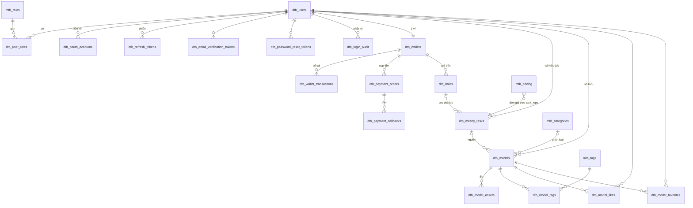

# InnerStyle — Database Design

> Bản thiết kế CSDL hoàn chỉnh cho nền tảng cá nhân hoá mô hình 3D (pipeline MeshyAI).
> Tuân theo `rules/14-database-schema.md`, `rules/08-database-migration.md`,
> `rules/11-multi-role-system.md`, `rules/16-file-url-storage.md`.
>
> Engine: **PostgreSQL 16** · Migrations: **Flyway** (versioned, immutable) ·
> Cache/rate-limit: **Redis** (xem `redis-cache-design.md`).

## 1. Quy ước chung

| Quy ước | Giá trị |
|--------|---------|
| Bảng master (lookup, ít đổi) | prefix `mtb_`, FK trỏ tới dùng `ON DELETE RESTRICT` |
| Bảng giao dịch | prefix `dtb_`, FK giữa các `dtb_` dùng `ON DELETE CASCADE` |
| Quan hệ tuỳ chọn (con sống lâu hơn cha) | `ON DELETE SET NULL` |
| Khoá chính | `UUID DEFAULT gen_random_uuid()` (master nhỏ dùng `SERIAL`) |
| Thời gian | `TIMESTAMPTZ DEFAULT NOW()`, lưu UTC |
| Enum | `VARCHAR + CHECK` (map JPA `@Enumerated(STRING)`) — dễ mở rộng |
| Tên FK | `fk_<table>_<column>` · Tên index `idx_<table>_<cols>` |
| Tiền | `NUMERIC(15,2)`, một loại tiền tệ trong ví (mặc định `VND`) |
| File/media | lưu **đường dẫn tương đối** trong DB, build URL tuyệt đối ở tầng DTO |

## 2. Sơ đồ quan hệ (ERD)



## 3. Module Auth & Identity

Hỗ trợ đầy đủ: đăng ký email/mật khẩu, **xác minh email**, **quên/đặt lại mật khẩu**,
**social login** (Google/Facebook), **JWT access + refresh có xoay vòng & thu hồi**,
khoá tài khoản chống brute-force, và **RBAC nhiều role** (USER / ADMIN).

| Bảng | Vai trò | Điểm chính |
|------|---------|-----------|
| `mtb_roles` | Role hệ thống | Seed `USER`,`ADMIN`; FK trỏ tới = RESTRICT |
| `dtb_users` | Tài khoản | `password_hash` NULL-able (social-only); email unique **không phân biệt hoa thường** qua `UNIQUE(LOWER(email))`; `status`, `email_verified`, `failed_login_count`, `locked_until` |
| `dtb_user_roles` | Gán role (n-n) | PK `(user_id, role_id)` |
| `dtb_oauth_accounts` | Liên kết social | `UNIQUE(provider, provider_user_id)` |
| `dtb_refresh_tokens` | Phiên refresh | Chỉ lưu **SHA-256 hash**; `revoked_at`, `replaced_by` (token rotation) |
| `dtb_email_verification_tokens` | Token verify email | hashed, `expires_at`, `used_at` |
| `dtb_password_reset_tokens` | Token reset mật khẩu | hashed, TTL ngắn |
| `dtb_login_audit` | Forensics đăng nhập | `user_id` SET NULL để giữ lại bản ghi |

Lý do thiết kế đáng chú ý:
- **Không lưu token thô** — chỉ lưu hash, ngăn rò rỉ nếu DB lộ.
- **`replaced_by` self-FK** trên refresh token để truy vết chuỗi xoay vòng và phát hiện reuse.
- **`UNIQUE(LOWER(email))`** tránh trùng `A@x.com` vs `a@x.com`.

## 4. Module Wallet & Payment — mô hình "cọc/giữ tiền" (authorization hold)

Tiền không bị trừ ngay khi bắt đầu tạo 3D. Thay vào đó **giữ** (hold) một khoản, chỉ
**trừ thật (capture)** khi job thành công, và **hoàn (release)** nếu job lỗi.

| Bảng | Vai trò |
|------|---------|
| `mtb_pricing` | Đơn giá mỗi loại job 3D (`task_type` → `unit_price`) — quyết định số tiền giữ |
| `dtb_wallets` | 1 ví / user: `available_balance` (tiêu được) + `held_balance` (đang giữ) + `version` (optimistic lock) |
| `dtb_payment_orders` | Đơn nạp tiền qua **VNPAY/MOMO**: `order_code` idempotent, `status`, `provider_txn_ref` |
| `dtb_payment_callbacks` | Log thô IPN/return từ cổng (audit + chống replay) |
| `dtb_holds` | Bản ghi giữ tiền: `HELD → CAPTURED \| RELEASED \| EXPIRED`, `captured_amount ≤ amount` |
| `dtb_wallet_transactions` | **Sổ cái bất biến** — mỗi thay đổi số dư = 1 dòng (`TOPUP/HOLD/CAPTURE/RELEASE/REFUND/ADJUSTMENT`), kèm `available_after`, `held_after` |

Vòng đời tiền (bất biến số học `available + held` không tự sinh/mất ngoài TOPUP/CAPTURE):

```
Nạp tiền   : available += amount        | ledger TOPUP
Bắt đầu job: available -= price; held += price   | hold(HELD) + ledger HOLD
Job OK     : held -= price                | hold→CAPTURED + ledger CAPTURE
Job FAIL   : held -= price; available += price    | hold→RELEASED + ledger RELEASE
Hold hết hạn: như RELEASE                 | hold→EXPIRED + ledger RELEASE
```

Bảo toàn dữ liệu:
- `CHECK (available_balance >= 0)` và `CHECK (held_balance >= 0)` chặn âm tiền ở tầng DB.
- `version BIGINT` cho JPA `@Version` → chống race khi 2 job đồng thời giữ tiền.
- Mọi thao tác ví chạy trong **một transaction**: cập nhật `dtb_wallets` + ghi `dtb_wallet_transactions` + đổi trạng thái `dtb_holds`.
- `idx_dtb_holds_active_expiry` (partial, `WHERE status='HELD'`) để job nền quét hold quá hạn và tự release.

## 5. Module Library (thư viện 3D + gallery công khai chuẩn SEO)

| Bảng | Vai trò |
|------|---------|
| `dtb_models` | Mô hình 3D đã hoàn thiện; `visibility` (PRIVATE/UNLISTED/PUBLIC), `status`, `slug` UNIQUE cho SEO, `like_count`/`view_count`, `is_featured` |
| `dtb_model_assets` | File tải về theo định dạng (GLB/FBX/OBJ/texture/thumbnail), `file_url` tương đối |
| `mtb_categories` | Danh mục gallery (`slug` SEO) |
| `mtb_tags` + `dtb_model_tags` | Tag chuẩn hoá (n-n) |
| `dtb_model_likes`, `dtb_model_favorites` | Tương tác user (UNIQUE theo (model,user)) |

Index phục vụ truy vấn thực tế:
- `idx_dtb_models_public_feed` — **partial index** `WHERE visibility='PUBLIC' AND status='PUBLISHED'` cho feed gallery (rất chọn lọc, nhỏ gọn).
- `idx_dtb_models_search` — **GIN full-text** trên `name + description` cho ô tìm kiếm.
- `source_task_id` SET NULL: giữ model trong thư viện kể cả khi job gốc bị dọn.

## 6. Liên kết Meshy tasks (bảng có sẵn)

`dtb_meshy_tasks` được bổ sung:
- `user_id` (CASCADE) — chủ sở hữu job; index `(user_id, created_at DESC)` cho lịch sử.
- `hold_id` (SET NULL) — khoản cọc backing job; cập nhật trạng thái hold theo kết quả job.

Hai cột để **NULL-able** vì migration Flyway là bất biến và bảng đã có dữ liệu.

## 7. Thứ tự & danh sách migration

| Thứ tự | File | Nội dung |
|--------|------|----------|
| (đã có) | `V20260617120000__create_meshy_tasks_table.sql` | bảng meshy gốc |
| (đã có) | `V20260619120000__update_meshy_task_type_constraint.sql` | sửa CHECK task_type |
| mới | `V20260619130000__create_auth_tables.sql` | roles, users, user_roles, oauth, tokens, audit |
| mới | `V20260619131000__create_wallet_payment_tables.sql` | pricing, wallets, payment_orders, callbacks, holds, ledger |
| mới | `V20260619132000__create_library_tables.sql` | categories, tags, models, assets, likes, favorites |
| mới | `V20260619133000__link_meshy_tasks_to_user_and_hold.sql` | thêm `user_id`,`hold_id` vào meshy_tasks |

Đã validate cú pháp toàn bộ bằng parser chính thức của PostgreSQL (libpg_query/pglast) — pass.

## 8. Việc cần làm ở bước code (chưa làm — chờ duyệt)

- Thêm dependency: `spring-boot-starter-security`, `jjwt`, `spring-boot-starter-data-redis`,
  `spring-boot-starter-mail`, `spring-boot-starter-validation` vào `pom.xml`.
- Entity/Repository/Service/Controller cho từng module theo `rules/`.
- Seeder profile-gated cho `mtb_categories`, `mtb_tags` (KHÔNG seed trong migration).
- Tích hợp SDK/redirect VNPay & MoMo (ký checksum, verify IPN).
